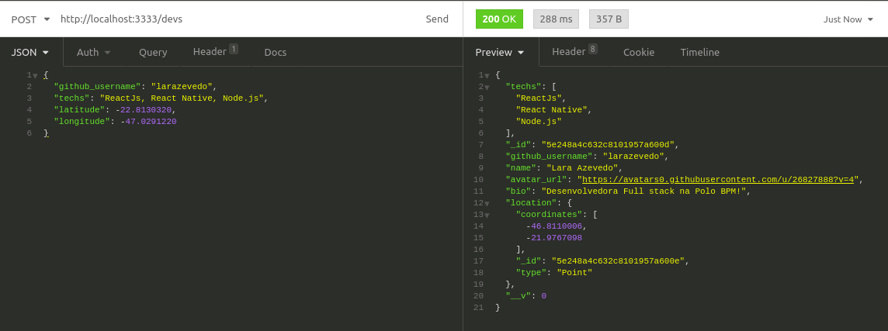
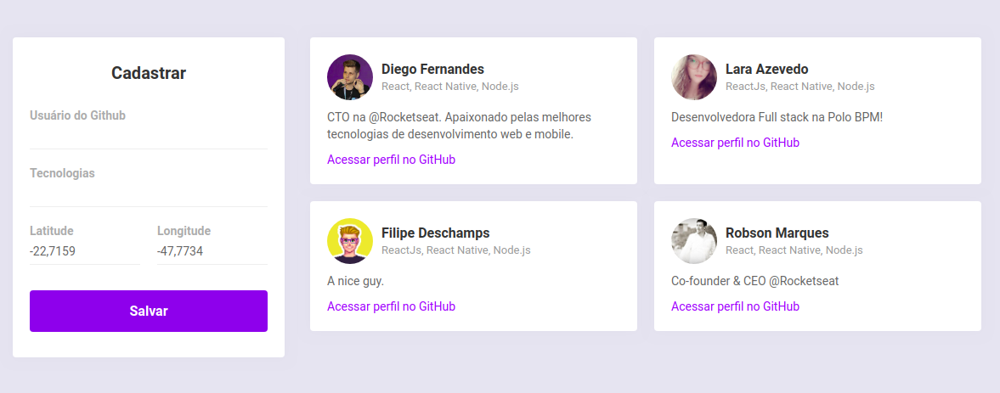
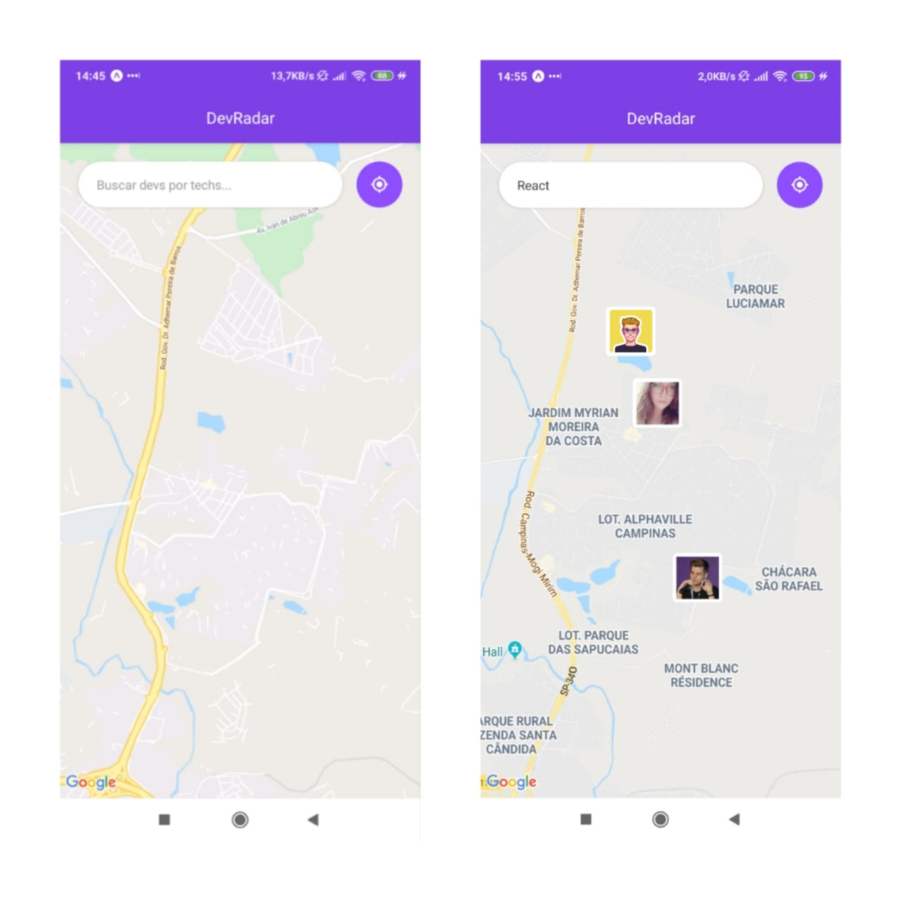

# DevRadar
Aplicação desenvolvida na SemanaOmnistack10 da Rocketseat!
  

Tecnologias utilizadas: 

## Backend - Node.js/Express

No backend, ao fazermos o cadastro de um Dev, utilizamos a API do Github para trazer mais informações do perfil cadastrado.

## Web: ReactJS
Já na Web, a API é consumida e acompanhamos em tempo real cada novo cadastro realizado.

## Mobile: React Native/Expo
No APP, através da geolocalização, conseguimos fazer uma busca por Devs, de acordo com a teclonogia, em uma distância de até 10km.

